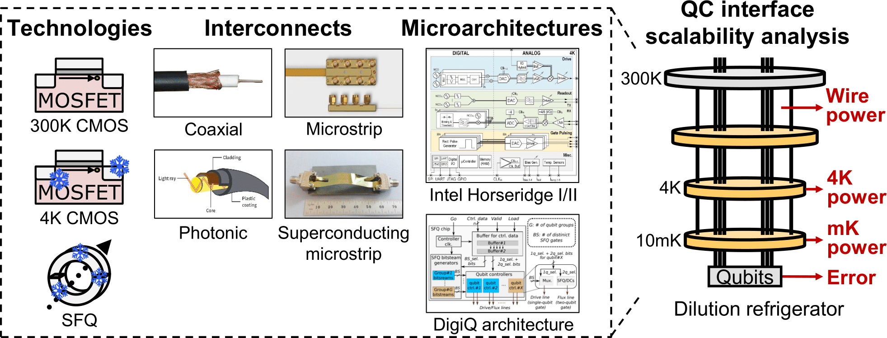
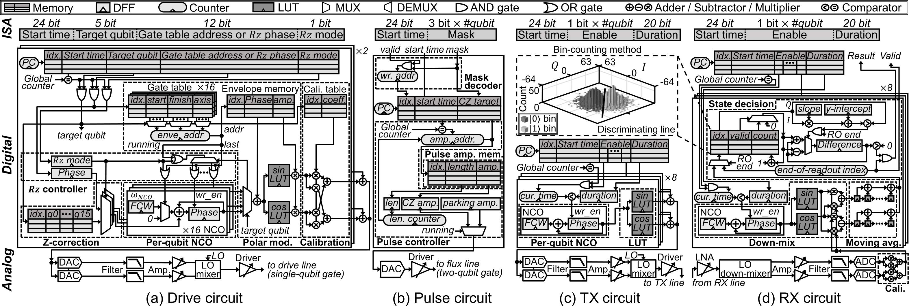
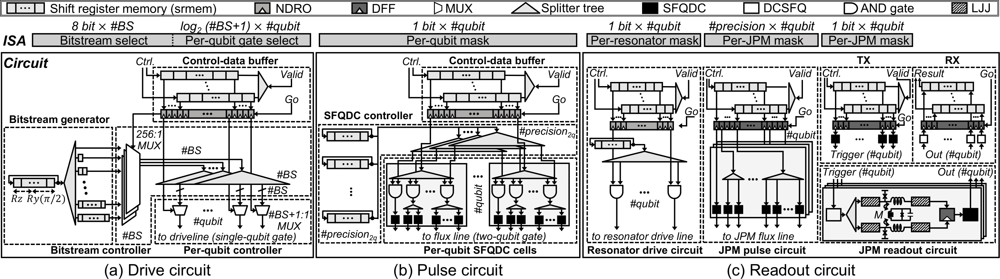

# QIsim: '*Q*'uantum-classical '*I*'nterface '*SIM*'ulator

QIsim is the **scalability analysis tool for quantum-classical interface (QCI)**.
QIsim evaluates the target QCI's scalability in terms of the fidelity and runtime-power consumption.
The major strength of QIsim is its wide technology coverage; it supports (1) 300K QCIs with the coaxial cable, (2) microstrip, and (3) photonic link, (4) 4K CMOS-based QCI, and (5) 4K SFQ-based QCI.
QIsim is developed by **[HPCS Lab](https://hpcs.snu.ac.kr)** in Seoul National University (*SNU*).

QIsim consists of the following four submodels: (1) *4K device model*, (2) *gate-error model*, (3) *timing simulator*, and (4) *workload-level error simulator*. Please refer to our QIsim paper (published on ISCA'23 [\[1\]](#markdown-header-publications)) for more details of our modeling methodology.

#### Current version
The current version covers the baseline design of QIsim except Optimization #1~8.

#### Pre-requirement
* Linux packages
    * libprotobuf-dev, protobuf-compiler, libboost1.65-all-dev
* Python packages
    * pandas, protobuf, cython, numpy, absl-py, ipython, qiskit, qutip, ray, Quanlse, SupermarQ
* Open-source frameworks
    * [Yosys](https://github.com/YosysHQ/yosys), [JoSIM](https://joeydelp.github.io/JoSIM)
* Commercial frameworks
    * [Design Compiler Topographical Mode](https://www.synopsys.com/implementation-and-signoff/rtl-synthesis-test/dc-ultra.html)

Here is the commands for linux and python packages.
For the open-source and commercial frameworks, please install them individually.
Note that Design Compiler is only needed when you change the 4K CMOS QCI microarchitecture.
```
apt install libprotobuf-dev protobuf-compiler libboost1.65-all-dev
pip install pandas protobuf cython numpy absl-py ipython qiskit qutip ray Quanlse SupermarQ
```

## 0. Contents
* [1. 4K device model](https://github.com/SNU-HPCS/QIsim/blob/master/README.md#1-4k-device-model)
    * [1-1. 4K CMOS-based QCI](https://github.com/SNU-HPCS/QIsim/blob/master/README.md#1-1-4k-cmos-based-qci)
    * [1-2. 4K SFQ-based QCI](https://github.com/SNU-HPCS/QIsim/blob/master/README.md#1-2-4k-sfq-based-qci)
* [2. Gate-error model](https://github.com/SNU-HPCS/QIsim/blob/master/README.md#2-gate-error-model)
    * [2-1. 1Q gate error of CMOS-based QCIs](https://github.com/SNU-HPCS/QIsim/blob/master/README.md#2-1-1q-gate-error-of-cmos-based-qcis)
    * [2-2. 2Q gate error of CMOS-based QCIs](https://github.com/SNU-HPCS/QIsim/blob/master/README.md#2-2-2q-gate-error-of-cmos-based-qcis)
    * [2-3. Readout error of CMOS-based QCIs](https://github.com/SNU-HPCS/QIsim/blob/master/README.md#2-3-readout-error-of-cmos-based-qcis)
    * [2-4. 1Q gate error of SFQ-based QCIs](https://github.com/SNU-HPCS/QIsim/blob/master/README.md#2-1-1q-gate-error-of-sfq-based-qcis)
    * [2-5. 2Q gate error of SFQ-based QCIs](https://github.com/SNU-HPCS/QIsim/blob/master/README.md#2-2-2q-gate-error-of-sfq-based-qcis)
    * [2-6. Readout error of SFQ-based QCIs](https://github.com/SNU-HPCS/QIsim/blob/master/README.md#2-3-readout-error-of-sfq-based-qcis)
        * [2-6-1. JPM state preparation stage](https://github.com/SNU-HPCS/QIsim/blob/master/README.md#2-6-1-jpm-state-preparation-stage)
        * [2-6-2. JPM readout stage](https://github.com/SNU-HPCS/QIsim/blob/master/README.md#2-6-2-jpm-readout-stage)
* [3. Timing simulator](https://github.com/SNU-HPCS/QIsim/blob/master/README.md#3-timing-simulator)
    * [3-1. Workload generation](https://github.com/SNU-HPCS/QIsim/blob/master/README.md#3-1-workload-generation)
    * [3-2. CMOS-based QCI](https://github.com/SNU-HPCS/QIsim/blob/master/README.md#3-2-cmos-based-qci)
    * [3-3. 4K SFQ-based QCI](https://github.com/SNU-HPCS/QIsim/blob/master/README.md#3-3-4k-sfq-based-qci)
* [4. Workload-level error simulator](https://github.com/SNU-HPCS/QIsim/blob/master/README.md#4-workload-level-error-simulator)
    * [4-1. Error simulator for NISQ workloads](https://github.com/SNU-HPCS/QIsim/blob/master/README.md#4-1-error-simulator-for-nisq-workloads)
    * [4-2. Error simulator for FTQC workloads](https://github.com/SNU-HPCS/QIsim#4-2-error-simulator-for-ftqc-workloads)
* [5. Contributors](https://github.com/SNU-HPCS/QIsim/blob/master/README.md#5-contributors)
* [6. Publication](https://github.com/SNU-HPCS/QIsim/blob/master/README.md#6-publication)

## 1. 4K device model

4K device model predicts the frequency and per-access energy consumption of 4K CMOS and SFQ-based QCIs.

### 1-1. 4K CMOS-based QCI



Our 4K CMOS device model supports the microarchitecture shown in the above figure. 
Powered by [CryoModel](https://github.com/SNU-HPCS/CryoModel), our 4K device model supports the CMOS voltage scaling at 4K.
The device model also supports various technology nodes (i.e., 45nm, 22nm, 14nm, 7nm) following the ITRS projection. 
If you want to evaluate your new microarchitecture, please update the corresponding Verilog codes in ```./device_model/cmos/CryoModel/CryoPipeline/src_vlg```.

**Note that our 4K CMOS model does not yet provide the easy interface to change the QCI microarchitecture.** 
To evaluate the new microarchitecture with different configuration (e.g., different bit width, new architecture), you should 
 1. update the corresponding Verilog codes in ```./device_model/cmos/CryoModel/CryoPipeline/src_vlg```, 
 2. remove the existing compilation results (i.e., critical_path_4k, power_4k) in ```./device_model/cmos/CryoModel/CryoPipeline/latency_result/*```, 
 3. and re-run the cmos_device_model.py.

#### Command:
```
python3.8 cmos_device_model.py -n {node} -d {Vdd} -r {Vth}
```

#### Options:
* node: transistor technology node (i.e., 45nm 22nm, 14nm, 7nm) [nm]
* Vdd: supply voltage in 45nm node [V]
* Vth: threshold voltage in 45nm node at 300K [V]

#### Output:
* static power of each subunit
* dynamic energy per access of each subunit

#### Example:
```
cd device_model/cmos
python3.8 cmos_device_model.py -n 14
```

### 1-2. 4K SFQ-based QCI



Our 4K-SFQ device model supports the microarchitecture shown in the above figure. The model is based on MITLL SFQ5ee library, and it supports both RSFQ and ERSFQ technologies.

#### Command:
```
python3.8 sfq_device_model.py -b {bs} -c {cable_width} -g {num_groups} -l {2q_gate_length} -q {num_qubits} -t {2q_precision} -y {y_length} -z {z_length}
```

#### Options:
* bs: maximum number of different 1Q gates applicable at the same time for each group
* cable_width: number of 300K-4K cables to send control signals
* num_groups: number of qubit groups (in which qubits have the same frequency)
* 2q_gate_length: bitstream length to generate the 2Q gate pulses
* num_qubits: number of qubits in the entire system
* 2q_precision: the precision of 2Q gate pulses
* y_length: bitstream length to generate the Y(π/2) pulse
* z_length: bitstream length to generate the RZ gate

#### Output:
* frequency, static/dynamic power, and area of each subunits
* frequency, static/dynamic power, and area of entire SFQ-based QCI

#### Example:
```
cd device_model/rsfq
python3.8 sfq_device_model.py -b 8 -c 32 -g 2 -l 1200 -q 1024 -t 5 -y 197 -z 256
```

## 2. Gate-error model

The gate-error model predicts 1Q gate, 2Q gate, and readout error for the given QCI microarchitecture.
The model supports both of two representative methods: CMOS-based QCIs and SFQ-based QCI.
The CMOS-based QCI includes the 300K QCI with coaxial cables / microstrips / photonic link and 4K CMOS-based QCI.

### 2-1. 1Q gate error of CMOS-based QCIs
#### Command:
```
python3.8 single_error_model.py -r {t1_time} -c {t2_time} -t {gate_time} -q {freq_qubit} -l {freq_lo} -n {nco_precision} -d {dac_precision} -p {pulse_type}
```

#### Options:
* t1_time: Relaxation time [us]
* t2_time: Coherence time [us]
* gate_time: 1Q gate time [ns]
* freq_qubit: Qubit frequency [GHz]
* freq_lo: Local oscillator frequency [GHz]
* nco_precision: NCO bit precision [bit]
* dac_precision: DAC bit precision [bit]
* pulse_type: Pulse type (i.e., DRAG, Gaussian, Square, GaussianSquare)

#### Outputs:
* 1Q error rate without decoherence
* 1Q error rate with decoherence

#### Example:
```
cd gate_error_model/cmos/1q_gate
python3.8 single_error_model.py -r 122000 -c 118000 -t 25 -q 5 -l 4 -n 22 -d 9 -p DRAG
```

### 2-2. 2Q gate error of CMOS-based QCIs
#### Command:
```
python3.8 cz_error_model.py -max {max_freq} -min {min_freq} -f1 {freq_qubit1} -f2 {freq_qubit2} -p {precision} -t {gate_time}
```

#### Options:
* max_freq: maximum qubit frequency that QCI supports [GHz]
* min_freq: minimum qubit frequency that QCI supports [GHz]
* freq_qubit1: the frequency of first qubit [GHz]
* freq_qubit2: the frequency of second qubit [GHz]
* precision: the bit precision of CZ pulse [bit]
* gate_time: CZ-gate time [ns]

#### Outputs:
* CZ gate error of the given condition

#### Example:
```
cd gate_error_model/cmos/2q_gate
python3.8 cz_error_model.py -max 6 -min 4 -f1 5.064 -f2 5 -p 12 -t 50
```

### 2-3. Readout error of CMOS-based QCIs
#### Command:
```
python3.8 readout_error_model.py -s {simulation_time} -r {ringup_time} -p {max_photon_num} -fq {freq_qubit} -fr {freq_resonator} -fl {freq_lo} -t1 {t1_time} -t2 {t2_time} -n {num_shots}
```

#### Options:
* simulation_time: simulation time [ns]
* ringup_time: ring-up time of the resonator [ns]
* max_photon_num: target number of photons in the resonator
* freq_qubit: qubit frequency [GHz]
* freq_resonator: resonator frequency [GHz]
* freq_lo: local oscillator frequency [GHz]
* t1_time: relaxation time (i.e., T1 time) [ns]
* t2_time: coherence time (i.e., T2 time) [ns]
* num_shots: number of independent measurements for simulation

#### Outputs:
* Readout error of single-point method (used in Google Sycamore)
* Readout error of bin-counting method (used in Intel Horseridge-II)

#### Example:
```
cd gate_error_model/cmos/readout
python3.8 readout_error_model.py -s 517 -r 117 -p 10 -fq 5 -fr 6 -fl 6 -t1 122000 -t2 118000 -n 1024
```

### 2-4. 1Q gate error of the SFQ-based QCI
#### Command:
```
python3.8 single_error_model.py -c {freq_clock} -q {freq_qubit} -y {max_y_length} -z {z_length} -d {depth}
```

#### Options:
* freq_clock: SFQ hardware's clock frequency [GHz]
* freq_qubit: Qubit frequency [GHz]
* max_y_length: Maximum target length of Y(π/2) bitstream
* z_length: Target length of RZ (i.e., RZ-gate precision)
* depth: Depth of design space exploration

#### Outputs:
* Y(π/2) bitstream length for minimum error rate
* Y(π/2), RZ gate error rate

#### Example:
```
cd gate_error_model/rsfq/1q_gate
python3.8 single_error_model.py -c 24 -q 4.14238 -y 300 -z 256 -d 3
```

### 2-5. 2Q gate error of the SFQ-based QCI
#### Command:
```
python3.8 cz_error_model.py -f1 {freq_qubit1} -f2 {freq_qubit2} -p {precision} -t {gate_time}
```

#### Options:
* freq_qubit1: the frequency of first qubit [GHz]
* freq_qubit2: the frequency of second qubit [GHz]
* precision: the bit precision of CZ pulse [bit]
* gate_time: CZ-gate time [ns]

#### Outputs:
* CZ gate error of the given condition

#### Example:
```
cd gate_error_model/rsfq/2q_gate
python3.8 cz_error_model.py -f1 5.02978 -f2 4.14238 -p 5 -t 50
```

### 2-6. Readout error of the SFQ-based QCI
The readout of the SFQ-based QCI consists of (1) JPM state preparation and (2) JPM readout stages.
The JPM state preparation is to convert the qubit state to the JPM state (i.e., resonator driving + JPM tunneling).
The JPM readout stage is to measure the JPM states using the mK-located SFQ circuits.

#### 2-6-1. JPM state preparation stage
#### Command:
```
python3.8 JPM_preparation_error_model.py -s {simulation_time} -fq {freq_qubit} -fr {freq_resonator} -fj {freq_jpm} -t1 {t1_time}
```

#### Options:
* simulation_time: simulation time [ns]
* freq_qubit: qubit frequency [GHz]
* freq_resonator: resonator frequency [GHz]
* freq_jpm: JPM frequency [GHz]
* t1_time: JPM relaxation time [ns]

#### Outputs:
* duration of state-preparation stage (resonator-driving and JPM tunneling).
* state-preparation error rate

#### Example:
```
cd gate_error_model/rsfq/readout/JPM_state_preparation
python3.8 JPM_preparation_error_model.py -s 750 -fq 4.14238 -fr 6.008188 -fj 7.008188 -t1 5
```

#### 2-6-2. JPM readout stage
We provide the simulators of two JPM-readout methods: (1) the baseline method in which each qubit has independent mK-located readout circuit and (2) the sharing method in which eight qubits share the single readout circuit for lower power consumption.

#### Command:
```
# Baseline method.
python3.8 jpm_readout_baseline.py

# Sharing method.
python3.8 jpm_readout_sharing.py -min {min_l_value} -max {max_l_value}
```

#### Options:
* min_l_value: minimum L value between JPMs to sweep [pH]
* max_l_value: maximum L value between JPMs to sweep [pH]

#### Outputs:
* Baseline method
  * JPM-readout error from monte-carlo simulation (under the process variation and thermal noise)
* Sharing method
  * JPM readout duration (i.e., detection delay)
  * Data-to-clock delay difference when reading |0> and |1> JPM states, respectively

#### Example:
```
# Baseline method.
cd gate_error_model/rsfq/readout/JPM_readout/baseline
python3.8 jpm_readout_baseline.py

# Sharing method
cd gate_error_model/rsfq/readout/JPM_readout/sharing
python3.8 jpm_readout_sharing.py --min 2 --max 6
```

## 3. Timing simulator

Based on the result of the 4K device model, the timing simulator derives the total execution time, executed timing of each gate, and runtime power consumption.
The simulator covers (1) CMOS-based QCIs (300K QCI with coaxial cables / microstrips / photonic link, 4K CMOS-based QCI) and (2) 4K SFQ-based QCI.
We provide two types of workloads: (1) NISQ workloads (SupermarQ) to evaluate the workload fidelity for NISQ era, and (2) FTQC workloads (ESM) to evaluate the logical-qubit error rate.

### 3-1. Workload generation

#### Command:
To generate NISQ workloads (SupermarQ),
```
cd ./timing_simulator/cmos
python3.8 gen_workloads.py

cd ./timing_simulator/rsfq
python3.8 gen_workloads.py
```

To generate ESM sequence for the logical-qubit error rate,
```
cd ./timing_simulator/cmos
python3.8 esm_generator.py

cd ./timing_simulator/rsfq
python3.8 esm_generator.py
```
After running the commands, you can find the target workloads in ```./timing_simulator/*/workloads```.

### 3-2. CMOS-based QCI
#### Command:
```
python3.8 cmos_timing_simulator.py -sm {simulation_mode} -s {1q_time} -t {2q_time} -m {readout_time} -q {qubits_per_group} -c {channels_per_group} -r {readout_group} -n {node} -d {Vdd} -v {Vth}
```

#### Options:
* simulation_mode: simulation mode (i.e., NISQ, FTQC)
* 1q_time: 1Q gate duration [ns]
* 2q_time: 2Q gate duration [ns]
* readout_time: readout duration [ns]
* qubits_per_group: Number of qubits sharing a single driveline in 4K CMOS QCI
* channels_per_group: Number of banks in 4K CMOS QCI
* readout_group: Number of qubits sharing a same TX/RX line
* node: Technology node of 4K CMOS QCI (i.e., 45nm, 22nm, 14nm, 7nm) [nm]
* Vdd: Operating voltage of 4K CMOS QCI [V]
* Vth: Threshold voltage of 4K CMOS QCI [V]

#### Outputs:
* executed timing of each gate (in ```./workloads_final```)
* Number of accesses for each subunits (in ```./results/stats```)
* Runtime power and its breakdown at each temperature domain (in ```./results/power_results```)

#### Example:
```
cd timing_simulator/cmos
python3.8 cmos_timing_simulator.py -sm FTQC -s 25 -t 50 -m 500 -q 32 -c 2 -r 8 -n 14
```

### 3-3. 4K SFQ-based QCI
#### Command:
```
python3.8 sfq_timing_simulator.py -sm {simulation_mode} -s {1q_time} -t {2q_time} -m {readout_time} -g {groups} -b {bs} -y {y_length} -z {z_length} -w {2q_precision} -c {tech_type}
```

#### Options:
* simulation_mode: simulation mode (i.e., NISQ, FTQC)
* 1q_time: 1Q gate duration [ns]
* 2q_time: 2Q gate duration [ns]
* readout_time: readout duration [ns]
* groups: Number of same-frequency qubit groups
* bs: Number of concurrently executable 1Q gates for each group
* y_length: Length of RY(pi/2) pulse
* z_length: Length of RZ pulse (RZ-gate precision)
* 2q_precision: DC-pulse precision for CZ gate
* tech_type: SFQ technology type (i.e., RSFQ, ERSFQ)

#### Outputs:
* executed timing of each gate (in ```./workloads_final```)
* Number of accesses for each subunits (in ```./results/stats```)
* Runtime power and its breakdown at each temperature domain (in ```./results/power_results```)

#### Example:
```
cd timing_simulator/rsfq
python3.8 sfq_timing_simulator.py -sm FTQC -s 25 -t 50 -m 700 -g 2 -b 8 -y 197 -z 256 -w 5 -c RSFQ
```

## 4. Workload-level error simulator

We also provide two types of workload-level error simulator: simulators for NISQ and FTQC workloads, repectively.
Before running the error simulator, the user should finish the timing simulation for the target workloads.

### 4-1. Error simulator for NISQ workloads
#### Command:
```
python3.8 nisq_error_simulator.py -s {1q_error} -t {2q_error} -r {t1_time} -c {t2_time} -t {timestep} -n {shots}
```

#### Options:
* 1q_error: 1Q error rate
* 2q_error: 2Q error rate
* t1_time: relaxation time [ns]
* t2_time: coherence time [ns]
* timestep: timestep for injecting the decoherence error [ns]
* shots: number of shots for error simulation

#### Outputs:
* Workload-level fidelity for each NISQ workload

#### Example:
```
cd timing_simulator/cmos
python3.8 nisq_error_simulator.py -s 8.17e-7 -t 0.0017 -r 122000 -c 118000 -t 100 -n 1000

cd timing_simulator/rsfq
python3.8 nisq_error_simulator.py -s 1.18e-4 -t 0.0023 -r 122000 -c 118000 -t 100 -n 1000
```

### 4-2. Error simulator for FTQC workloads
#### Command:
```
# for cmos
python3.8 ftqc_error_simulator.py -s {1q_error} -t {2q_error} -m {readout} -r {t1_time} -c {t2_time}

# for sfq
python3.8 ftqc_error_simulator.py -s {1q_error} -t {2q_error} -m {readout} -r {t1_time} -c {t2_time} -b {bs}
```

#### Options:
* 1q_error: 1Q error rate
* 2q_error: 2Q error rate
* t1_time: relaxation time [ns]
* t2_time: coherence time [ns]
* bs: number of concurrently executable 1Q gates of the SFQ-based QCI

#### Outputs:
* Logical qubit error using the MWPM-based decoder

#### Example:
```
# for cmos
cd timing_simulator/cmos
python3.8 ftqc_error_simulator.py -s 8.17e-7 -t 0.0017 -m 0.00103 -r 122000 -c 118000 

# for sfq
cd timing_simulator/rsfq
python3.8 ftqc_error_simulator.py -s 1.18e-4 -t 0.0023 -m 0.00779 -r 122000 -c 118000 -b 8
```

## 5. Contributors
* [Dongmoon Min](https://hpcs.snu.ac.kr/~dongmoon/)
* [Junpyo Kim](https://hpcs.snu.ac.kr/~junpyo/)
* [Junhyuk Choi](https://hpcs.snu.ac.kr/~junhyukchoi/)
* [Ilkwon Byun](https://hpcs.snu.ac.kr/~ilkwon/)
* [Jangwoo Kim](https://hpcs.snu.ac.kr/~jangwoo/)

## 6. Publication
If you use this modeling framework for your research, please cite the paper below.

[\[1\]](#markdown-header-publications) D. Min, J. Kim, J. Choi, I. Byun, K. Inoue, M. Tanaka, and J. Kim, “QIsim: Architecting 10+K Qubit QC Interfaces Toward Quantum Supremacy,” in *Proceedings of the 50th International Symposium on Computer Architecture (ISCA’23).*

